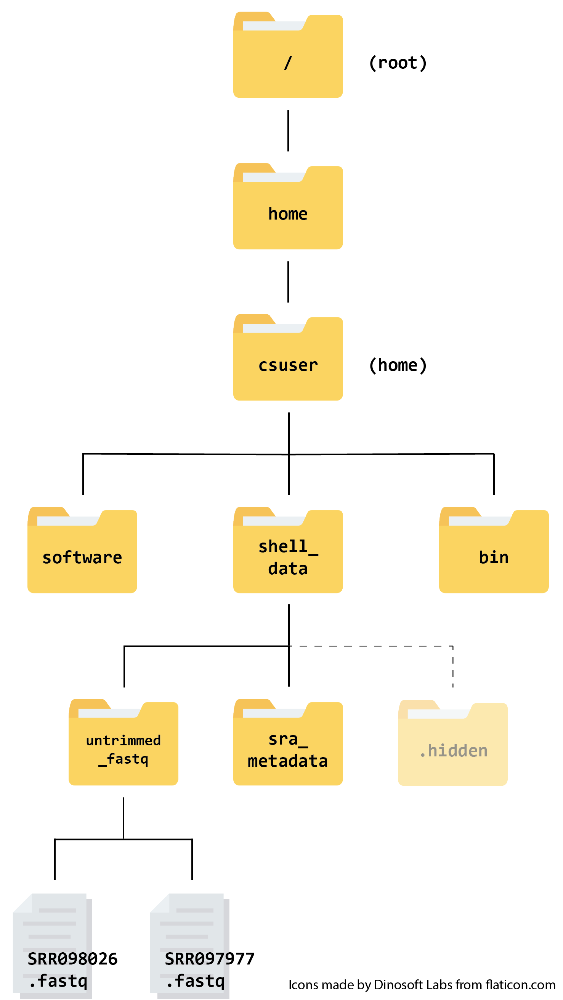

## Welcome to the Cloud-SPAN AWS instance!

In the first session we logged onto the Cloud for the first time. Today (and in subsequent sessions) we will be exploring this instance further and examining some of the data it holds.

As a reminder, we log in by launching Git Bash or Terminal from the `cloudspan` folder we made, and then using our `ssh` command. Take a look at the [full set of instructions](https://cloud-span.github.io/01genomics/05-logging-onto-cloud/index.html) if you have forgotten how to do any of this.

~~~
$ ssh -i login-key-instanceNNN.pem  csuser@instanceNNN.cloud-span.aws.york.ac.uk
~~~
{: .bash}

The instance is exactly the same as the one used in our Prenomics course, so you may have explored it already. The file structure looks like this:

{:width="400px"}

When we log into the instance, we start in the `csuser` directory (the home directory).

The files we will be using today and in future sessions are the `.fastq` files found in  `shell_data/untrimmed_fastq`. FASTQ is a format for storing information about sequencing reads and their quality. We will be learning more about FASTQ files in a [future lesson on this course](https://cloud-span.github.io/03genomics/01-quality-control/index.html).

## Writing files

In the Prenomics course we worked a lot with files that already existed, but what if we want to write our own files? We're not going to type in a FASTA file, but we'll see as we go through other tutorials, there are a lot of reasons we'll want to write a file, or edit an existing file.

To add text to files, we're going to use a text editor called Nano. We're going to create a file to take notes about the data files in `shell_data/untrimmed_fastq`.

This is good practice when working in bioinformatics. We can create a file called `README.txt` that describes the data files in the directory or documents how the files in that directory were generated.  As the name suggests, it's a file that we or others should read to understand the information in that directory.

Let's change our working directory to `shell_data/untrimmed_fastq` using `cd`,
then run `nano` to create a file called `README.txt`:

~~~
$ cd shell_data/untrimmed_fastq
$ nano README.txt
~~~
{: .bash}

You should see something like this:

The text at the bottom of the screen shows the keyboard shortcuts for performing various tasks in `nano`. We will talk more about how to interpret this information soon.

> ## Text editors
>
> Text editors," like nano, "notepad" on Windows or "TextEdit" on Mac are used to edit any [plain text files](https://www.howtogeek.com/465420/what-is-plain-text/). Plain text files are those that contain only characters, not images or formatting.  
>
> We are using nano because it is one of the least complex Unix text editors. However,
> many programmers use [Emacs](http://www.gnu.org/software/emacs/) or
> [Vim](http://www.vim.org/) (both of which require more time to learn),
> or a graphical editor such as [Gedit](http://projects.gnome.org/gedit/).
>
> No matter what editor you use, you will need to know where it searches
> for and saves files. If you start it from the shell, it will (probably)
> use your current working directory as its default location.
{: .callout}

Add a couple of lines of text to the README.txt with the date and the types of file we are working with (FASTQ). We can add more to this document later.
Once you're happy with the text, use <kbd>Ctrl</kbd>-<kbd>O</kbd> and then <kbd>Return</kbd> to accept the suggested default of `README.txt`.

Now use <kbd>Ctrl</kbd>-<kbd>X</kbd> to quit the editor and return to the shell.

> ## Control, Ctrl, or ^ Key
>
> The Control key is also called the "Ctrl" key. There are various ways
> in which using the Control key may be described. For example, you may
> see an instruction to press the <kbd>Ctrl</kbd> key and, while holding it down,
> press the <kbd>X</kbd> key, described as any of:
>
> * `Control-X`
> * `Control+X`
> * `Ctrl-X`
> * `Ctrl+X`
> * `^X`
> * `C-x`
>
> In `nano`, along the bottom of the screen you'll see `^G Get Help ^O WriteOut`.
> This means that you can use <kbd>Ctrl</kbd>-<kbd>G</kbd> to get help and <kbd>Ctrl</kbd>-<kbd>O</kbd> to save your
> file.
>
> If you are using a Mac, you might be more familiar with the `Command` key, which is labelled with a <kbd>⌘</kbd> . 
> But you will often use the the `Ctrl` key when working in a Terminal.
{: .callout}

Now you've written a file. You can take a look at it with `less` or `cat`, or open it up again and edit it with `nano`.

> ## Exercise
>
> Open `README.txt`, add your name and institution to the top of the file, and save the file.
>
> > ## Solution
> >
> > Use `nano README.txt` to open the file.
> > Add your name and institution and then use <kbd>Ctrl</kbd>-<kbd>X</kbd> followed by `y` and <kbd>Enter</kbd> to save.
> >
> {: .solution}
>
{: .challenge}

## FASTQ file format

Before we start playing with our FASTQ files, we should remind ourselves of the FASTQ file format. We will learn about this in more detail in a [future lesson on this course](https://cloud-span.github.io/03genomics/01-quality-control/index.html). If you took the Prenomics course you should recall learning about this format previously.

{:width="600px"}

In the FASTQ file format, each 'read' (i.e. sequence) is described in four lines of information.

- The first line always starts with an @ followed by the sequence identifier (also called the header or label) and may contain other information such as the read length.
- The second line is the sequence of bases itself
- The third line is a separator line which always starts with a '+' and may repeat the information from line 1
- The fourth line is a string of characters representing the quality scores for each base

## Writing scripts

A really powerful thing about the command line is that you can write scripts. A script contains a list of commands that you want to run. They are useful because it means you have a record of the commands you want and they can be run repeatedly.  Though writing scripts may require an additional time investment initially, they make your work reproducible and efficient.

One thing we might want to do with sequencing results is pull out bad reads and write them to a file to see if we can figure out what's going on with them. We did this [on day two of the Prenomics course](https://cloud-span.github.io/prenomics02-command-line/03-redirection/index.html) using the `grep` command. Here is a reminder of the different commands we used to do this:

| Command  | Use |
| ------------- | ------------- |
| `grep pattern filename`  | Identifies and prints sequences that match a given pattern within a file  |
| `grep -v pattern filename`  | Identifies and prints sequences that do not match a given pattern  |
| `grep -B1 -A2  pattern filename`  | Identifies and prints sequences that match a given pattern, plus one line before (`B1`) and two lines after (`A2`) |
| `>`  | Redirect output of a function to a given file e.g. `grep pattern filename > newfile`|
| `>>` | Redirect and append the output of a function to a give file (similar to `>` but does not overwrite the file contents) |
| `|` | Pipes the output of one function into another  |
| `wc` | Counts number of words, lines and characters in a file |

 We're going to look for reads with long sequences of N's like we did before, but now we're going to write a script, so we can run it each time we get new sequences, rather than type the code in by hand each time.

We're going to create a new file to put this command in. We'll call it `bad-reads-script.sh`. The `sh` isn't required, but using that extension tells us that it's a shell script.

~~~
$ nano bad-reads-script.sh
~~~
{: .bash}

Bad reads have a lot of N's, so we're going to look for  `NNNNNNNNNN` with `grep`. We want the whole FASTQ record, so we're also going to get the one line above the sequence and the two lines below. We also want to look in all the files that end with `.fastq`, so we're going to use the `*` wildcard.

Add this to your script:

~~~
grep -B1 -A2 -h NNNNNNNNNN *.fastq > scripted_bad_reads.txt
~~~
{: .bash}

This will search through all the files ending `.fastq` and write the reads containing `NNNNNNNNNN` to a file, `scripted_bad_reads.txt`

> ## Custom `grep` control
>
> We are using `-h` to "Suppress the prefixing of file names on output" according to the documentation shown by `man grep`.
>
{: .callout}

Save `bad-reads-script.sh` and exit nano.

Now comes the neat part. We can run this script with:

~~~
$ bash bad-reads-script.sh
~~~
{: .bash}

It will look like nothing happened, but now if you look at `scripted_bad_reads.txt`, you can see that there are now reads in the file.

> ## Exercise
>
> We want the script to tell us when it's done.
> 1. Open `bad-reads-script.sh` and add the line `echo "Script finished!"` after the `grep` command.  Save `bad-reads-script.sh` and exit nano.
> 2. Run the updated script.
>
> > ## Solution
> > 
> > Use `nano bad-reads-script.sh` to open the file.
> > Add `echo "Script finished!"` and then use <kbd>Ctrl</kbd>-<kbd>X</kbd> followed by `y` and <kbd>Enter</kbd> to save.
> > 
> > ~~~
> >  $ bash bad-reads-script.sh
> > ~~~
> > {: .bash}
> > 
> > ~~~
> > Script finished!
> > ~~~
> > {: .output}
> >
> {: .solution}
{: .challenge}

### File Permissions

View the current permissions on a file using the `-l` (long) flag for the `ls` command:

~~~
$ ls -l
~~~
{: .bash}

The first part of the output for the `-l` flag gives you information about the file's current permissions. There are ten slots in the
permissions list. The first character in this list is related to file type, not permissions, so we'll ignore it for now. The next three
characters relate to the permissions that the file owner has, the next three relate to the permissions for group members, and the final
three characters specify what other users outside of your group can do with the file. We're going to concentrate on the three positions
that deal with your permissions (as the file owner).

{:width=600px}

Here the three positions that relate to the file owner are `rw-`. The `r` means that you have permission to read the file, the `w`
indicates that you have permission to write to (i.e. make changes to) the file, and the third position is a `-`, indicating that you
don't have permission to carry out the ability encoded by that space (this is the space where `x` or executable ability is stored).

## Making the script into a program

We had to type `bash` because we needed to tell the computer what program to use to run this script. Instead, we can turn this script into its own program. We need to tell it that it's a program by making it executable. We can do this by changing the file permissions. We are going to use the `bad-read-scripts.sh` file we generated earlier in the episode.

Look at the current permissions for `bad-read-scripts.sh` .

~~~
$ ls -l bad-reads-script.sh
~~~
{: .bash}

~~~
-rw-rw-r-- 1  csuser 0 Oct 25 21:46 bad-reads-script.sh
~~~
{: .output}

We see that it says `-rw-r--r--`. This shows that the file can be read by any user and written to by the file owner (you). We want to change these permissions so that the file can be executed as a program. We use the command `chmod`. Here we are adding (`+`) executable permissions (`x`).

~~~
$ chmod +x bad-reads-script.sh
~~~
{: .bash}

Now let's look at the permissions again.

~~~
$ ls -l bad-reads-script.sh
~~~
{: .bash}

~~~
-rwxrwxr-x 1 csuser csuser 0 Oct 25 21:46 bad-reads-script.sh
~~~
{: .output}

Now we see that it says `-rwxr-xr-x`. The `x`'s that are there now tell us we can run it as a program. So, let's try it! We'll need to put `./` at the beginning so the computer knows to look here in this directory for the program.

~~~
$ ./bad-reads-script.sh
~~~
{: .bash}

The script should run the same way as before, but now we've created our very own computer program!

## Moving and Downloading Data

So far, we've worked with data that is pre-loaded on the instance in the cloud. Usually, however,
most analyses begin with moving data onto the instance. Below we'll show you some commands to
download data onto your instance, or to move data between your computer and the cloud.

### Getting data from the web to your instance

There are two programs that will download data from a remote server to your local
(or remote) machine: ``wget`` and ``curl``. They were designed to do slightly different
tasks by default, so you'll need to give the programs somewhat different options to get
the same behaviour, but they are mostly interchangeable.

 - ``wget`` is short for "world wide web get", and it's basic function is to *download*
 web pages or data at a web address.

 - ``cURL`` is a pun, it is supposed to be read as "see URL", so its basic function is
 to *display* webpages or data at a web address.

We are going to use `curl` to download some data from Ensembl. So this doesn't take too long, the file we're going to download is a very small
tab-delimited file that just tells us what data is available on the Ensembl bacteria server.

~~~
$ cd
$ curl -O ftp://ftp.ensemblgenomes.org/pub/release-37/bacteria/species_EnsemblBacteria.txt
~~~
{: .bash}

The `-O` flag tells `curl` to save the file, using the same name, rather than just showing it to us.

It's important to note that `curl`  downloads to the *computer that the
command line belongs to*. So, if you are logged into AWS on the command line and execute
the `curl` command above in the AWS terminal, the file will be downloaded to your AWS
machine, not your local one.

### Moving files between your laptop and your instance

What if the data you need is on your local computer, but you need to get it *into* the
cloud? There are also several ways to do this, but it's *always* easier
to start the transfer locally. **This means if you're typing into a terminal, the terminal
should not be logged into your instance, it should be showing your local computer. If you're
using a transfer program, it needs to be installed on your local machine, not your instance.**

## Transferring Data Between your Local Machine and the Cloud

### Using scp for file transfer

`scp` stands for 'secure copy protocol', and is a widely used UNIX tool for moving files
between computers. This is run in your **local terminal**.

The `scp` command takes this form:

~~~
scp <file I want to move> <where I want to move it>
~~~
{: .bash}

Note that you always run `scp` locally, but you can still move files in either direction.

To move a file from your local computer to your AWS instance, the command would look like this:

~~~
$ scp <local file> <AWS instance>
~~~
{: .bash}

To move a file from your AWS instance to your local computer, you re-order the `to` and `from` fields:

~~~
$ scp <AWS instance> <local file>
~~~
{: .bash}

You also need to tell `scp` that you are authorised to have access to your AWS instance. This is done using the same `login-key-instanceNNN.pem` login key you use to log into the instance.

You tell `scp` to look for your login key using the flag `-i`.

> ## What is your AWS instance called?
> The address you should use for your AWS instance has two main parts: your login credentials and your file path.
> - the first part has the format `csuser@instanceNNN.cloud-span.aws.york.ac.uk` where `NNN` is replaced by your instance's unique number.
> - the second part is the file path where you want to send/download your file, for example `/home/csuser/`.
> - the two parts are separated by a colon with **no** spaces.
{: .callout}

### Uploading Data to your Virtual Machine with scp

Make a text file called `test.txt` in your `cloudspan` folder on your local machine. It doesn't matter what is in it - we just want a file to work with.

Launch another Git Bash or Terminal from the `cloudspan` folder. You will now have two terminals, one logged on to your instance and one, the **local terminal** not.
Now use `scp` to upload `test.txt` to the `csuser` home directory **(make sure you substitute `instanceNNN` with your instance's number)**. Type the following into the local terminal:

~~~
$  scp -i login-key-instanceNNN.pem test.txt csuser@instanceNNN.cloud-span.aws.york.ac.uk:/home/csuser/
~~~
{: .bash}

If you were using `instance001` and copying the file `test.txt` the command would look like this.  

~~~
$  scp -i login-key-instance001.pem test.txt csuser@instance001.cloud-span.aws.york.ac.uk:/home/csuser/
~~~

Note this assumes that `test.txt` **and** the login key file are in your working directory - i.e., the directory you launched Git Bash or Terminal from. You can check your working directory with `pwd`.

**Tip:** If  `test.txt` or your login key file, or both, are not in your working directory then you will need to give the relative paths to them.

### Downloading from your AWS instance with scp

We will transfer the file containing the bad reads from your AWS instance to your local machine. That file is in  `shell_data/untrimmed_fastq/scripted_bad_reads.txt` on your instance.

Now use `scp` to transfer `shell_data/untrimmed_fastq/scripted_bad_reads.txt` to the `cloudspan` directory **(make sure you substitute `instanceNNN` with your instance's number)**. Type the following into the local terminal:

~~~
$ scp -i login-key-instanceNNN.pem csuser@instanceNNN.cloud-span.aws.york.ac.uk:/home/csuser/shell_data/untrimmed_fastq/scripted_bad_reads.txt .
~~~
{: .bash}

**Note** Don't miss out the `.` at the end! We wanted to download the file to our `cloudspan` directory and the `cloudspan` directory is our working directory therefore we use `.` meaning "to *this* directory"
